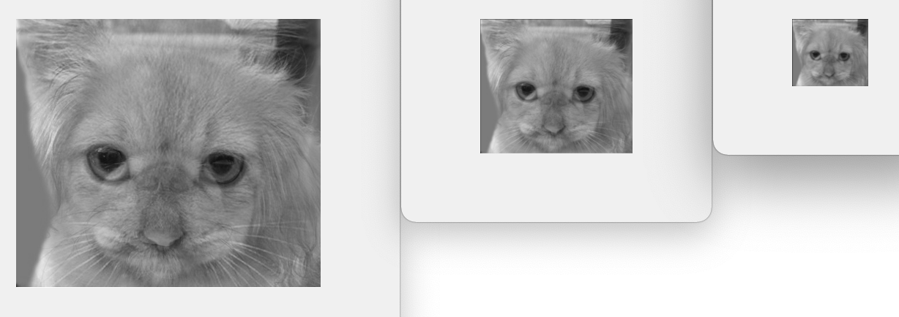
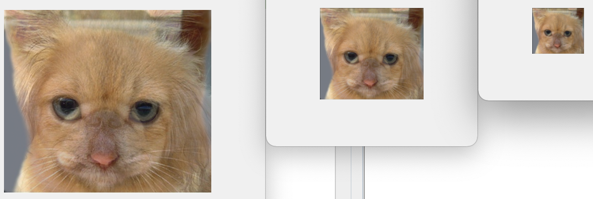

# DIP Lab02 Report

---

[toc]

Author: Songqing Zhao, Minzu University of China

Written at Oct 14^th^, 2021

---

**Reference:**

> [Pyramid (image processing)](https://en.wikipedia.org/wiki/Pyramid_(image_processing)#Laplacian_pyramid)
>
> [[CV] 4. Multi-Scale Representation (Gaussian and Laplacian Pyramid)](https://medium.com/jun-devpblog/cv-4-multi-scale-representation-gaussian-and-laplacian-pyramid-527ca4c4831c)
>
> [laplacianBlend](https://github.com/rayryeng/laplacianBlend)
>
> [Image-Processing-Techniques](https://github.com/PavanGJ/Image-Processing-Techniques)
>
> [Blurring images](https://datacarpentry.org/image-processing/06-blurring/)

---

## Lab Purpose

1. Make a low-pass filter using Gaussian Blur, and show the image
2. Make a Laplacian Pyramid and a Gaussian Pyramid
3. Blend two images using Pyramid method
4. Adjust parameter of the Gaussian kernel, then comparing  the result image

## Lab Principle

### Gaussian Blur

#### Intro from Wiki

In [image processing](https://en.wikipedia.org/wiki/Image_processing), a **Gaussian blur** (also known as **Gaussian smoothing**) is the result of blurring an image by a [Gaussian function](https://en.wikipedia.org/wiki/Gaussian_function) (named after mathematician and scientist [Carl Friedrich Gauss](https://en.wikipedia.org/wiki/Carl_Friedrich_Gauss)). 

It is a widely used effect in graphics software, typically to reduce [image noise](https://en.wikipedia.org/wiki/Image_noise)and reduce detail. The visual effect of this blurring technique is a smooth blur resembling that of viewing the [image](https://en.wikipedia.org/wiki/Image) through a translucent screen, distinctly different from the [bokeh](https://en.wikipedia.org/wiki/Bokeh) effect produced by an out-of-focus lens or the shadow of an object under usual illumination.

#### Mathematics from Wiki

The Gaussian blur is a type of image-blurring filter that uses a Gaussian function (which also Labresses the [normal distribution](https://en.wikipedia.org/wiki/Normal_distribution) in statistics) for calculating the [transformation](https://en.wikipedia.org/wiki/Transformation_(mathematics)) to apply to each [pixel](https://en.wikipedia.org/wiki/Pixel) in the image.

In two dimensions, it is the product of two such Gaussian functions, one in each dimension:
$$
G(x,y)=\frac{1}{2\pi\sigma^2}e^{-\frac{x^2+y^2}{2\sigma^2}}
$$
where *x* is the distance from the origin in the horizontal axis, *y* is the distance from the origin in the vertical axis, and *σ* is the [standard deviation](https://en.wikipedia.org/wiki/Standard_deviation) of the Gaussian distribution. When applied in two dimensions, this formula produces a surface whose [contours](https://en.wiktionary.org/wiki/contour) are [concentric circles](https://en.wikipedia.org/wiki/Concentric_circles) with a Gaussian distribution from the center point.

#### Gaussian kernel

To apply this filter to the current pixel, a weighted average of the the color values of the pixels in the kernel is calculated. In a Gaussian blur, the pixels nearest the center of the kernel are given more weight than those far away from the center. This averaging is done on a channel-by-channel basis, and the average channel values become the new value for the filtered pixel. Larger kernels have more values factored into the average, and this implies that a larger kernel will blur the image more than a smaller kernel.[^1]

### Pyramid

here are two main types of pyramids: lowpass and bandpass.

A lowpass pyramid is made by smoothing the image with an appropriate smoothing filter and then subsampling the smoothed image, usually by a factor of 2 along each coordinate direction. The resulting image is then subjected to the same procedure, and the cycle is repeated multiple times. Each cycle of this process results in a smaller image with increased smoothing, but with decreased spatial sampling density (that is, decreased image resolution). If illustrated graphically, the entire multi-scale representation will look like a pyramid, with the original image on the bottom and each cycle's resulting smaller image stacked one atop the other.

A bandpass pyramid is made by forming the difference between images at adjacent levels in the pyramid and performing image interpolation between adjacent levels of resolution, to enable computation of pixelwise differences.

**Pyramid**, or **pyramid representation**, is a type of [multi-scale](https://en.wikipedia.org/wiki/Scale_model) [signal](https://en.wikipedia.org/wiki/Signal_(information_theory))[representation](https://en.wikipedia.org/wiki/Knowledge_representation) developed by the [computer vision](https://en.wikipedia.org/wiki/Computer_vision), [image processing](https://en.wikipedia.org/wiki/Image_processing) and [signal processing](https://en.wikipedia.org/wiki/Signal_processing) communities, in which a signal or an image is subject to repeated [smoothing](https://en.wikipedia.org/wiki/Smoothing) and [subsampling](https://en.wikipedia.org/wiki/Downsampling). Pyramid representation is a predecessor to [scale-space representation](https://en.wikipedia.org/wiki/Scale_space) and [multiresolution analysis](https://en.wikipedia.org/wiki/Multiresolution_analysis).

#### Laplacian Pyramid 

A Laplacian pyramid is very similar to a Gaussian pyramid but saves the difference image of the blurred versions between each levels. Only the smallest level is not a difference image to enable reconstruction of the high resolution image using the difference images on higher levels. This technique can be used in [image compression](https://en.wikipedia.org/wiki/Image_compression).

#### Gaussian Pyramid

In a Gaussian pyramid, subsequent images are weighted down using a Gaussian average ([Gaussian blur](https://en.wikipedia.org/wiki/Gaussian_blur)) and scaled down. Each pixel containing a local average corresponds to a neighborhood pixel on a lower level of the pyramid. This technique is used especially in [texture synthesis](https://en.wikipedia.org/wiki/Texture_synthesis).

## Lab Procedure

### Make Gaussian Kernel Handle

Using 5 times 5 kernel. This kernel’s parameter imitates the default setting of the Gaussian Filter.

```matlab
cw = .375;
ker1d = [.25-cw/2 .25 cw .25 .25-cw/2]*1;
kernel = kron(ker1d,ker1d');
```

### Use Kernel to Make Gaussian Blur

Then put the current kernel into `imfilter`function from the standard toolbox of MatLab

```matlab
input_blur = imfilter(input, kernel, 'conv');
```


### Make Pryamid Down Function

According to the last part, we just need a compress for the blurred image. Code is below.

```matlab
function [output] = PryDown(input)
%PRYDOWN Summary of this function goes here
%   Detailed Lablanation goes here

% kernelWidth = 5; % default
cw = .375;
ker1d = [.25-cw/2 .25 cw .25 .25-cw/2]*1;
kernel = kron(ker1d,ker1d');

input_blur = imfilter(input, kernel, 'conv');

[r,c] = size(input);
input_blur_row = input_blur(1:2:r,:);
output = input_blur_row(:,1:2:c);

end

```


### Make Pryamid Up Function

```matlab
function [output] = PryUp(input)
%PRYUP Summary of this function goes here
%   Detailed Lablanation goes here
[r, c] = size(input);

cw = .375;
ker1d = [.25-cw/2 .25 cw .25 .25-cw/2]*1.9;
kernel = kron(ker1d,ker1d');

inputDouble = zeros(r*2, c*2);
inputDouble(1:2:end,1:2:end) = input;
output = imfilter(inputDouble, kernel, 'conv');

end

```


### Make Laplacian Pyramid

```matlab
img_blur = img - PryUp(PryDown(img));
subplot(1,2,1), imshow(img);
subplot(1,2,2), imshow(img_blur);
```


### Make Pryamid to Blend Two Images

Using the Laplacian pyramids for both images, a simple alpha masking operation is performed at each scale, and then propagated upwards towards the final master scale.  After, a blended Laplacian pyramid is created and the final step is to collapse the pyramid to generate a blended image.  This is done by taking the smallest scale of the blended Laplacian pyramid, Labanding the image so that it matches the dimensions of the second smallest scale and adding those results to the second smallest scale in the Laplacian pyramid.  This procedure is repeated until the original scale is reached, thus resulting in our blended image.

```matlab
function [gauss, laplace] = Pry(input, layerNum)
%PRY Summary of this function goes here
%   Detailed Lablanation goes here

gauss = cell(1,layerNum);
laplace = cell(1,layerNum);

gauss{1} = input;

for i=2:layerNum
    gauss{i} = PryDown(gauss{i-1});
    laplace{i-1} = gauss{i-1} - PryUp(gauss{i});
end

laplace{layerNum} = gauss{layerNum};

end
```



```matlab
function [output] = PyrFusion(input1, input2, N)
%PRYFUSION Summary of this function goes here
%   Detailed explanation goes here

if N == 0
    N = 5;
end

[g1, l1] = Pyr(input1, N);
[g2, l2] = Pyr(input2, N);

resL = cell(1, N);

for i=1:N
%     para1 = sum(g1{i});
%     para2 = sum(g2{i});
%     paraSum = para1 + para2;
%     para1 = para1 / paraSum;
%     para2 = 1 - para1;
    resL{i} = l1{i} * 0.5 + l2{i} * 0.5;
%     figure, imshow(g1{i});
end

resG = cell(1, N);
resG{N} = resL{N};

for i=N-1:-1:1
    resG{i} = PyrUp(resG{i+1}) + resL{i};
end
output = resG;

end

```

### Update Current Pyramid to Blend RGB Images

```matlab
function [result] = RgbFusion(img1, img2, N)
%RGBFUSION Summary of this function goes here
%   Detailed Lablanation goes here

if N == 0
    N = 5;
end

redResult = PryFusion(img1(:,:,1), img2(:,:,1), N);

greenResult = PryFusion(img1(:,:,2), img2(:,:,2), N);
blueResult = PryFusion(img1(:,:,3), img2(:,:,3), N);

for i=1:N-1
    result = cat(3, redResult{i}, greenResult{i}, blueResult{i});
    figure, imshow(result);
end

end

```



### Test the Module

```matlab
N = 4;

img1 = imread('../img/1.jpg');
img1 = im2double(img1);

img2 = imread('../img/2.jpg');
img2 = im2double(img2);

RgbFusion(img1, img2, N);

% grayRes = PryFusion(rgb2gray(img1), rgb2gray(img2), N);
% for i=1:N-1
%     figure, imshow(grayRes{i});
% end

% [g1, l1] = Pry(rgb2gray(img1), N);
% [g2, l2] = Pry(rgb2gray(img2), N);
% 
% resL = cell(1, N);
% 
% for i=1:N
%     resL{i} = g2{i} * 0.2 + l1{i} * 0.8;
%     figure, imshow(resL{i});
% end

```

### Setting Parameters

Setting parameters is truly the most technical part of the Lab. In the Lab, we have several parts to adjust the parameters. 

#### Kernel in `PryDown.m`

The first is kernel’s scale. In `PryDown.m`, we choose 5 times 5 as our kernel, since MatLab default setting for its Standard toolbox uses the 5 times 5 kernel. For the same reason, kernel’s $\sigma$ sets as 0.375. The result is good comparing with kernel times 1.05, 1.1, 0.95 and 0.9.

#### Kernel in `PryUp.m`

The second is also about kernel, but it is in `PryUp.m`. By the default of MatLab, it sets kernel is double to the kernel in `PryDown.m`. But the result displayed on the screen is not satisfying. So we tried several times, finally use 1.9 times the kernel in `PryDown.m` as our official parameter.

#### Proportion of the Two Aimed Laplacian Image

The third is about proportion of the two aimed laplacian image when using Laplacian Pyramid blending two image. At beginning, we just use the 50 to 50 as our defualt value. Then we started our adjusting. It’ really a hard work, and every time we change the value of the proportion doesn’t  meet the level of the default. We used coede like:

```matlab
for i=1:N
    para1 = sum(g1{i});
    para2 = sum(g2{i});
    paraSum = para1 + para2;
    para1 = para1 / paraSum;
    para2 = 1 - para1;
    resL{i} = l1{i} * para1 + l2{i} * para2;
%     figure, imshow(g1{i});
end
```

Or 

```matlab
resL{i} = l1{i} * para2 + l2{i} * para1;
```

#### Use Gaussian and Laplacian Image to Blend

The fourth is about use Gaussian and Laplacian image to blend. Result is also not better then the former. Code is below.

```matlab
[g1, l1] = Pry(rgb2gray(img1), N);
[g2, l2] = Pry(rgb2gray(img2), N);

resL = cell(1, N);

for i=1:N
    resL{i} = g2{i} * 0.2 + l1{i} * 0.8;
    figure, imshow(resL{i});
end

```

## Lab Result

Setting parameter is too hard.

:)

[^1]:https://datacarpentry.org/image-processing/06-blurring/

